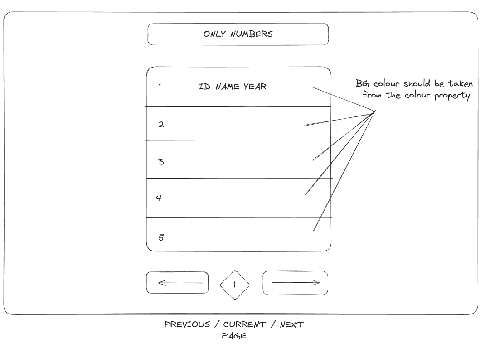

# SPA application as recreuitment tasks for *CODIBLY*


### Tasks
- display the paginated list of products ( 5 items per page ) ( pagination should be in as query parameter in URL)
- after click on product, display modal which contains all items data
- handle all 4XX and 5XX errors, inform user about it
- use debounce hook

<br />

 ```
$ git clone https://github.com/HajMichal/JobTask-from-Codibly.git

$ cd JobTask-from-Codibly

$ npm install

$ npm run dev
```
<br />
 
 
 ## Stack: 
- React,
- Typescirpt,
- TailwindCSS,
- Axios,
- Zustand,
- react-hot-toast
- 
<br />

## Schema

